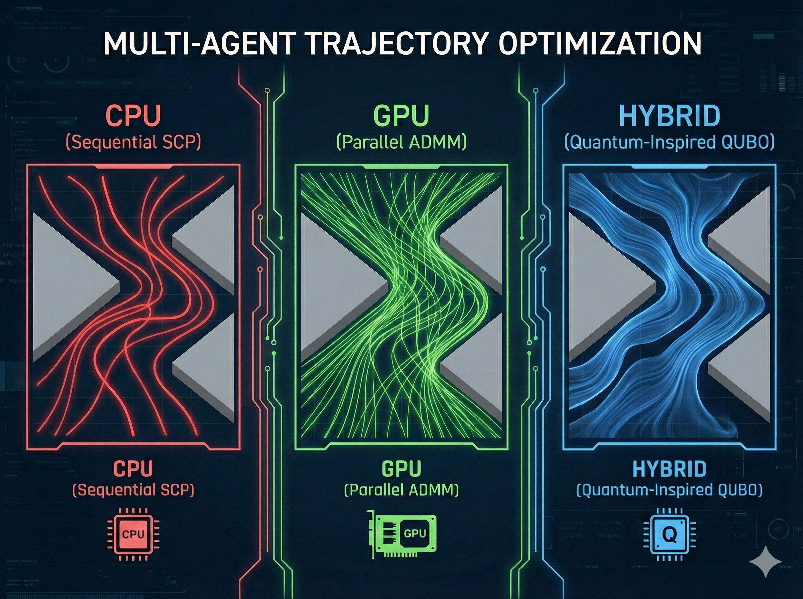
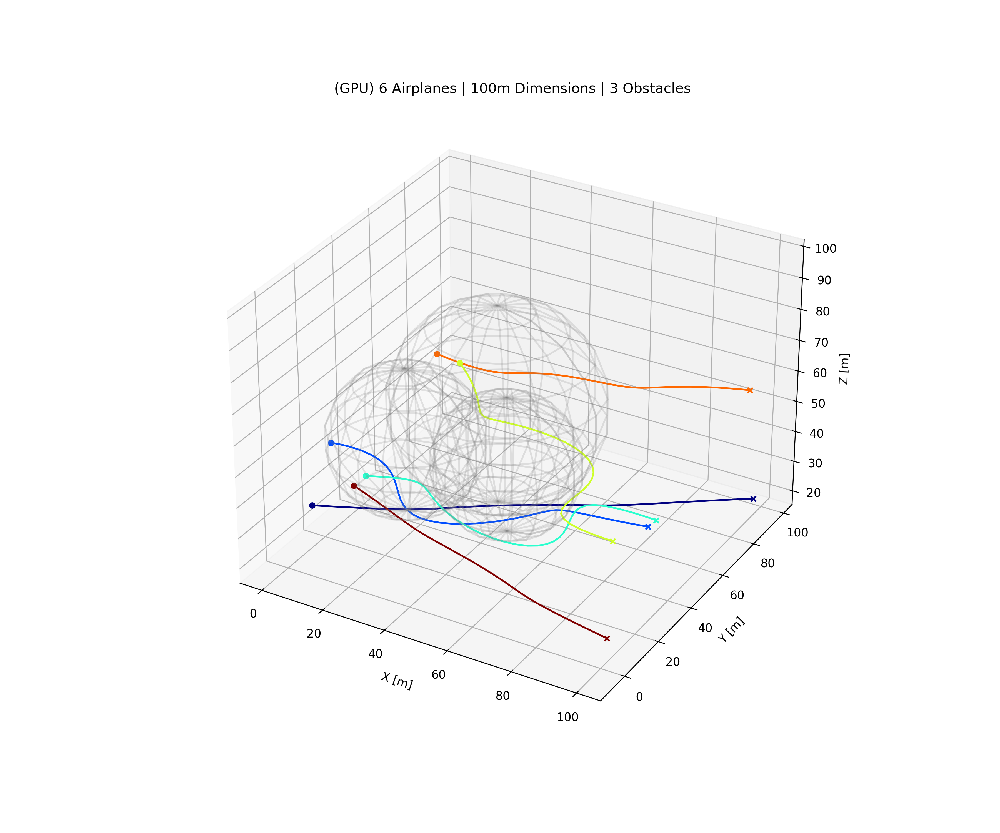

<p align="center">
  
</p>

<h1 align="center">✈️ Flight Optimizer</h1>

<p align="center">
  <b>Multi-agent 3D trajectory planning, solved three ways: sequential CPU, parallel GPU, and QUBO annealing.</b>
</p>

<p align="center">
  
  
  
  
</p>

---

## What is this?

Given **N airplanes**, each with a start and goal point, and a 3D box filled with **spherical obstacles**, find smooth trajectories that:

- 🚫 never enter an obstacle (radius + safety buffer)
- 🤝 never come closer than the safe distance to each other
- 🌊 minimize acceleration (smooth, efficient flight)

The project implements **three different solvers** for the same problem and compares them on safety, path efficiency, smoothness and runtime, so you can see how each approach scales from 6 planes to 100.

<!-- Add a GIF/screenshot of a result here, e.g. data/results/plots/gpu_result.png -->
<p align="center">
  
</p>

## The three solvers

| Solver | Approach | Strength |
|---|---|---|
| **CPU Sequential** | Plans one plane at a time; earlier planes become moving obstacles for later ones | Simple, most direct paths |
| **GPU Joint** | Optimizes all planes simultaneously with a batched KKT system on the GPU (CuPy) | Scales to large fleets, largest safety margin |
| **Hybrid QUBO** | Generates candidate paths (Bézier primitives) per plane and picks the best combination by solving a QUBO with simulated annealing (D-Wave Ocean) | Smoothest trajectories |

Under the hood, the CPU and GPU solvers represent each trajectory as a **degree-7 Bernstein polynomial** with fixed boundary conditions (position and velocity at start/end), and iteratively project violating points onto the safe region using a penalty / dual-update scheme (ADMM-style). The QUBO solver encodes "pick exactly one path per plane" and "these two paths collide" as binary quadratic penalties.

> **Note:** the hybrid solver uses D-Wave's *classical* simulated annealing sampler locally. It is formulated as a QUBO, so it can be pointed at real quantum annealing hardware, but no quantum hardware is required to run it.

## Sample results

One 3-way comparison run (see `data/results/analysis/comparison_report.csv`):

| Solver | Agent collisions | Min separation [m] | Avg path length [m] | Detour ratio | Smoothness cost |
|---|---|---|---|---|---|
| CPU | 0 | 6.98 | 228.55 | **1.008** | 6.19 |
| GPU | 0 | **7.36** | 246.28 | 1.166 | 25.70 |
| Hybrid | 0 | 5.89 | 242.82 | 1.096 | **0.28** |

*(Lower is better for detour ratio and smoothness; higher is better for separation.)*

## Quick start

```bash
git clone https://github.com/<your-username>/flight_optimizer.git
cd flight_optimizer
pip install -r requirements.txt
```

> `cupy-cuda12x` requires an NVIDIA GPU with CUDA 12. Without one, the GPU solver automatically falls back to NumPy, so everything still runs.

### Run a scenario

```bash
# main.py <planes> <box size [m]> <obstacles> --solver {cpu,gpu,hybrid}
python main.py 25 200 6 --solver cpu

# Use "-" to reuse the previous scenario's value, so all solvers see the SAME scenario
python main.py - - - --solver gpu
python main.py - - - --solver hybrid
```

Each run saves a 3D plot and a CSV log under `data/results/`.

### Compare the solvers

```bash
python src/analysis.py
```

Generates `comparison_report.csv` plus bar charts for safety, path efficiency and smoothness in `data/results/analysis/`.

### Try it on Google Colab (free T4 GPU)

Open `flight_optimizer.ipynb` in Colab, upload the project as `flight_optimizer.zip`, and run all cells. It walks through four benchmark scenarios:

| Scenario | Planes | Box | Obstacles |
|---|---|---|---|
| 1 | 6 | 100×100 | 3 |
| 2 | 25 | 200×200 | 6 |
| 3 | 50 | 250×250 | 6 |
| 4 | 100 | 2000×2000 | 6 |

## Project structure

```
flight_optimizer/
├── main.py                    # CLI entry point
├── requirements.txt
├── flight_optimizer.ipynb     # Colab benchmark notebook
├── configs/
│   └── scenarios.yaml         # Generated scenario (planes, obstacles)
├── src/
│   ├── analysis.py            # Metrics + comparison charts
│   ├── cli_utils.py           # Argument parsing & scenario handling
│   ├── global_params.py       # Tunable constants (safe distance, penalties, ...)
│   ├── simulation.py          # Scenario model, CSV export, 3D visualization
│   ├── scripts/
│   │   └── generate_scenarios.py
│   └── solvers/
│       ├── base_solver.py
│       ├── cpu_solver.py
│       ├── gpu_solver.py
│       ├── hybrid_solver.py
│       └── trajectory_utils.py   # Bernstein basis + KKT matrices
└── data/results/              # Logs, plots, analysis (generated)
```

## Configuration

Tweak `src/global_params.py`:

| Parameter | Default | Meaning |
|---|---|---|
| `SAFE_DIST` | 3.0 m | Minimum distance between planes |
| `OBS_BUFFER` | 2.0 m | Extra margin around each obstacle |
| `RHO` | 1000 | Constraint penalty weight |
| `ALPHA` | 1.0 | Pull toward the straight-line reference |
| `POLY_ORDER` | 7 | Bernstein polynomial degree |
| `MAX_ITER_CPU / GPU` | 100 / 150 | Optimization iterations |
| `SAMPLES_HYBRID` | 1000 | Annealing reads |

## Limitations & ideas

- Obstacles are spheres; planes are point masses (no turning-rate or speed limits yet).
- The hybrid solver's pairwise conflict check grows as O(N² · C²) in planes and candidates, so it gets slow for large fleets.
- Ideas: dynamic obstacles, kinematic limits, smarter candidate generation, running on real quantum annealers.

## Contributing

Issues and pull requests are welcome. If you add a new solver, subclass `BaseSolver` in `src/solvers/` and register it in `main.py`.

## License

MIT, see [LICENSE](LICENSE).
